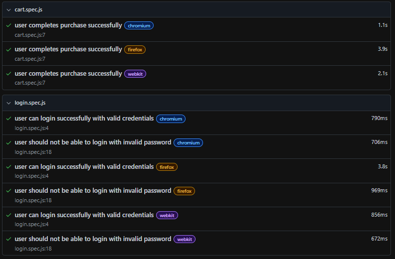

🧪 Playwright QA Automation Framework

📌 Overview

This project is an end-to-end UI automation testing framework built with Playwright using the Page Object Model (POM) design pattern.

It simulates a real-world e-commerce user journey, including:

* User authentication (valid and invalid login scenarios)
* Product selection
* Shopping cart validation
* Checkout process
* Order confirmation validation

The goal of this project is to demonstrate QA Automation skills, test design, and scalable framework structure.

🛠️ Tech Stack

* Playwright
* JavaScript (Node.js)
* Page Object Model (POM)
* Git & GitHub

📂 Project Structure

* pages/               # Page Object classes (locators + actions)
* tests/               # Test scenarios (user flows)
* playwright.config.js # Playwright configuration

🚀 Test Scenarios Covered

* User login (valid and invalid credentials)
* Add product to cart
* Validate cart contents
* Complete checkout process
* Order confirmation validation

▶️ How to Run Tests

1. Install dependencies

npm install

2. Run all tests

npx playwright test

3. Run tests in UI mode

npx playwright test --ui

4. View HTML report

npx playwright show-report

## 📊 Test Execution Report

Below is an example of the Playwright test execution report:

📊 Key Concepts Practiced

* End-to-End (E2E) Testing
* Page Object Model (POM)
* Locator strategies (id, CSS, data attributes)
* Assertions and validations
* Test automation best practices
* Git version control basics

🎯 Project Goal

This project was built as part of a QA Automation learning path to simulate real-world testing scenarios and demonstrate automation framework design skills.

👩‍💻 Author

Catalina Borja
QA Automation Engineer in training
Portfolio project for learning and professional growth
